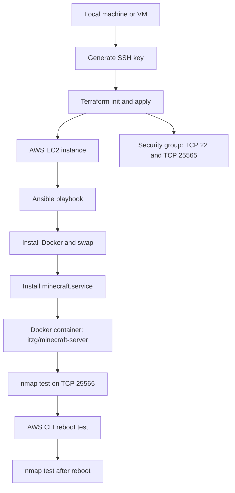

# Automated Minecraft Server Deployment on AWS

# Background

This repository automates the Minecraft server deployment that was previously done manually. The goal is to provision an AWS EC2 instance, configure networking, install Docker, run a Minecraft Java server container, and verify the server using `nmap` without using the AWS Management Console during the final demo.

The pipeline uses:

- **Terraform** to provision AWS infrastructure.
- **Ansible** to configure the EC2 instance.
- **Docker** to run the Minecraft Java server.
- **systemd** to start the server automatically after reboot and stop it cleanly.
- **AWS CLI** to reboot the instance for the restart test.

The Minecraft server listens on TCP port `25565`, which is the default Minecraft Java server port and the port used for the final `nmap` test.

# Architecture Diagram



# Requirements

Install these tools before running the project:

- Git
- Terraform `>= 1.6.0`
- Ansible
- AWS CLI v2
- `nmap`
- `ssh-keygen`
- Bash-compatible shell such as Linux, macOS Terminal, Git Bash, or WSL on Windows

# AWS Credentials

This project is intended for an AWS Academy Learner Lab account. Start the Learner Lab, copy the AWS CLI credentials, and configure them locally before running the scripts.

You can use either `aws configure` or exported environment variables.

Example using environment variables:

```bash
export AWS_ACCESS_KEY_ID="your_access_key"
export AWS_SECRET_ACCESS_KEY="your_secret_key"
export AWS_SESSION_TOKEN="your_session_token"
export AWS_DEFAULT_REGION="us-east-1"
```

Confirm that the AWS CLI works:

```bash
aws sts get-caller-identity
```

# Configuration

The main variable you may need to configure is your public IP address in CIDR format. This limits SSH/Ansible and Minecraft access to your machine.

You can let the script detect it automatically, or set it yourself:

```bash
export TF_VAR_admin_cidr="YOUR_PUBLIC_IP/32"
```

Example:

```bash
export TF_VAR_admin_cidr="203.0.113.10/32"
```

Other Terraform variables can be edited in `terraform/variables.tf`, such as:

- `aws_region`
- `project_name`
- `instance_type`

# Commands to Run

Run all commands from the repository root.

# 1. Generate a local SSH key

```bash
./scripts/00_generate_key.sh
```

This creates a local key pair in `.ssh/`. Terraform uploads the public key to AWS as an EC2 key pair. The private key stays local and is used by Ansible. Do not commit the `.ssh/` directory.

# 2. Provision AWS infrastructure

```bash
./scripts/01_provision.sh
```

This runs `terraform init` and `terraform apply`. Terraform creates:

- An EC2 instance using Amazon Linux 2023
- An EC2 key pair
- A security group
- An inbound TCP `22` rule for Ansible
- An inbound TCP `25565` rule for Minecraft and `nmap`
- An outbound rule for package and Docker image downloads

# 3. Configure the Minecraft server

```bash
./scripts/02_configure.sh
```

This script reads the public IP from Terraform, generates an Ansible inventory file, waits until the instance accepts SSH connections for Ansible, and runs the Ansible playbook.

Ansible installs Docker, adds swap space, creates `/opt/minecraft/data`, pulls the Minecraft Docker image, and installs the `minecraft.service` systemd unit.

# 4. Test the Minecraft port with nmap

```bash
./scripts/03_test.sh
```

The command runs:

```bash
nmap -sV -Pn -p T:25565 <instance_public_ip>
```

A successful result should show TCP port `25565` as open.

# 5. Test auto-start after reboot

```bash
./scripts/04_reboot_test.sh
```

This uses the AWS CLI to reboot the EC2 instance, waits for the instance status checks to pass, and runs the same `nmap` test again. If the port is open after reboot, the Minecraft server successfully restarted through `systemd`.

# How to Connect to the Minecraft Server

After provisioning, get the server address:

```bash
terraform -chdir=terraform output minecraft_address
```

Use the output in Minecraft Java Edition as the direct connection address.

For the required recording, the accepted non-client verification is:

```bash
terraform -chdir=terraform output nmap_command
./scripts/03_test.sh
```

# Clean Shutdown Design

The previous manual server setup auto-started, but Part 2 asks us to look into proper shutdown. This project handles that with `systemd` and Docker.

The service starts the Minecraft container in the foreground:

```ini
ExecStart=/usr/bin/docker run --rm --name minecraft ... itzg/minecraft-server:latest
```

The service stops Minecraft by sending the server's own stop command through RCON:

```ini
ExecStop=/usr/bin/docker exec minecraft rcon-cli stop
```

This is cleaner than simply killing the Java process because the Minecraft server gets a chance to save and shut down normally.

# Final Demo Checklist

For the recording, show the terminal only. Do not use the AWS Management Console.

1. Show AWS CLI identity:

```bash
aws sts get-caller-identity
```

2. Run the provisioning script:

```bash
./scripts/01_provision.sh
```

3. Run the configuration script:

```bash
./scripts/02_configure.sh
```

4. Show the public IP and test command:

```bash
terraform -chdir=terraform output public_ip
terraform -chdir=terraform output nmap_command
```

5. Run the nmap test:

```bash
./scripts/03_test.sh
```

6. Reboot and test auto-start:

```bash
./scripts/04_reboot_test.sh
```

# Resources and Sources Used

Terraform Documentation
Used as the main reference for infrastructure as code concepts and Terraform project structure.
Terraform AWS Provider: aws_instance
Used as a reference for provisioning the EC2 instance resource.
HashiCorp Terraform AWS EC2 Tutorial
Used as a reference for creating AWS EC2 infrastructure with Terraform.
AWS CLI Environment Variables
Used as a reference for AWS Academy temporary credentials and CLI authentication.
AWS EC2 Security Groups
Used as a reference for configuring inbound access to SSH and Minecraft TCP port 25565.
Ansible Inventory Documentation
Used as a reference for defining the EC2 instance as an Ansible managed host.
Ansible SSH Connection Documentation
Used as a reference for configuring Ansible to connect to the EC2 instance over SSH.
Ansible Playbook CLI Documentation
Used as a reference for running the configuration playbook.
itzg/minecraft-server Docker Image
Used as the Minecraft server Docker image. This image exposes the standard Minecraft server port 25565 and automatically downloads the server version.
itzg Minecraft Server Docker Configuration Docs
Used as a reference for configuring Minecraft server properties through Docker environment variables.
itzg Minecraft Server RCON Command Docs
Used as a reference for sending the Minecraft stop command through rcon-cli during service shutdown.
systemd Service Documentation
Used as a reference for creating the Minecraft systemd service and defining startup/shutdown behavior.
nmap Reference Guide
Used as a reference for the nmap -sV -Pn -p T:25565 <instance_public_ip> verification command.
GitHub Markdown Basic Syntax
Used as a reference for formatting this README.
